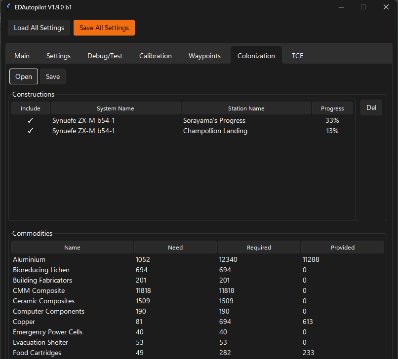
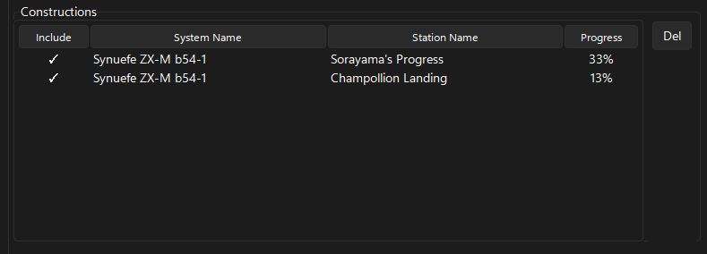
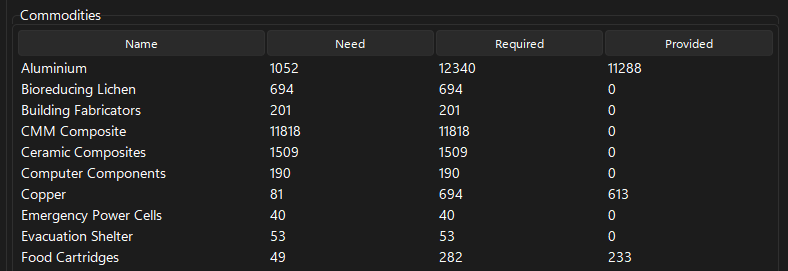

# Colonization Editor
Colonization editor allows you to edit your colonization projects.

Use the 'Load Construction Commodities' button on the 'Waypoints > Global Shopping List' tab to add the commodities selected to be included in the Global Shopping List. This will replace the current Global Shopping List.

## Colonization Editor

### Main buttons

* Open - Loads the construction data
* Save - Saves the construction data. The only data that can be saved is the 'Include' check state.

### Constructions List

The list...

* Del - Removes the selected construction project. Note that visiting the construction site (if it exists) will add the construction site again, so use the 'Include' check option to exclude the counting of commodities for ongoing constructions. 

### Commodities List

The list will include the commodities for all 'included' construction projects.