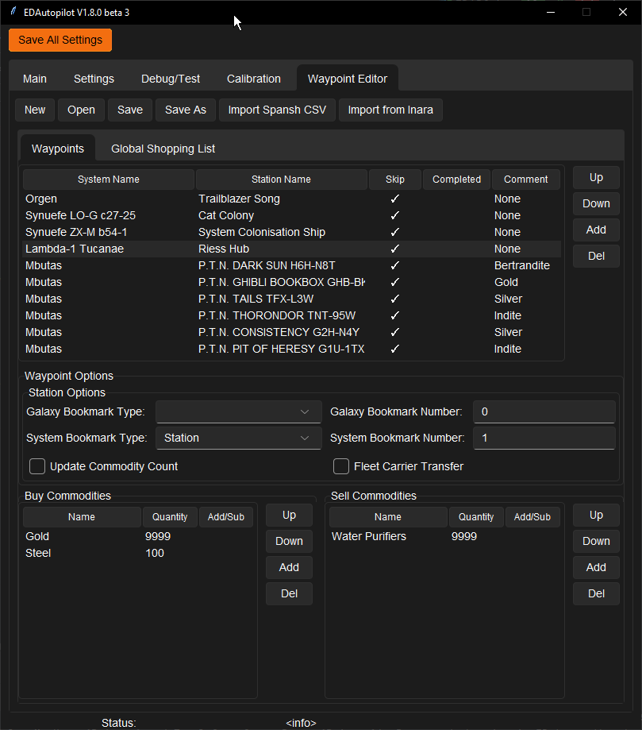
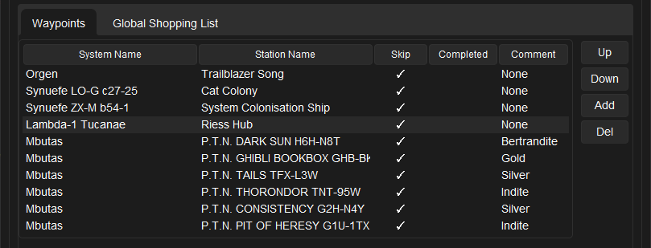
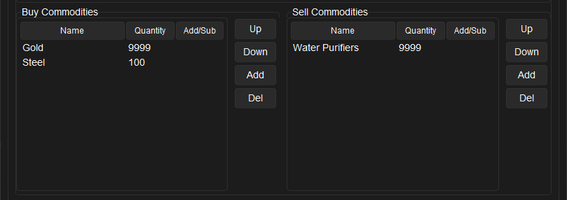
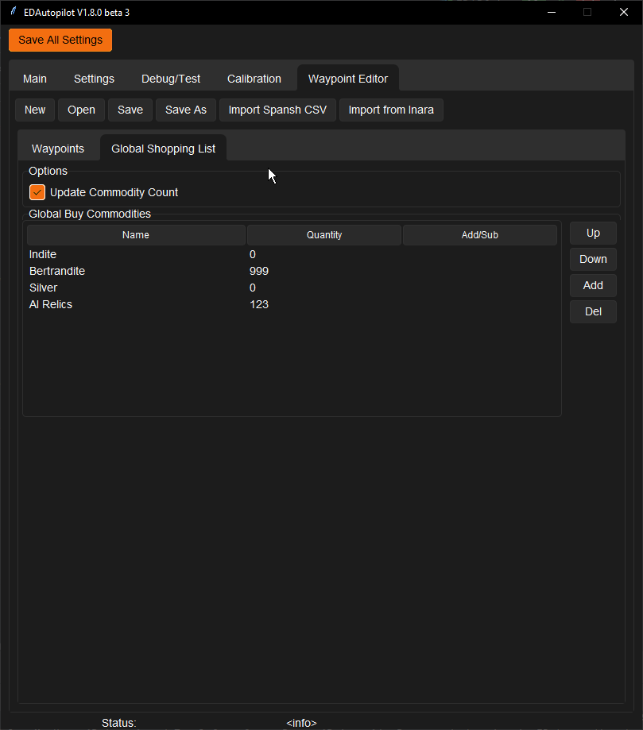
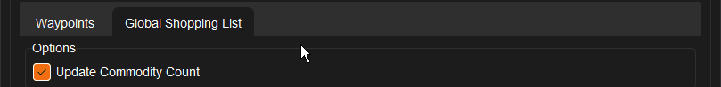
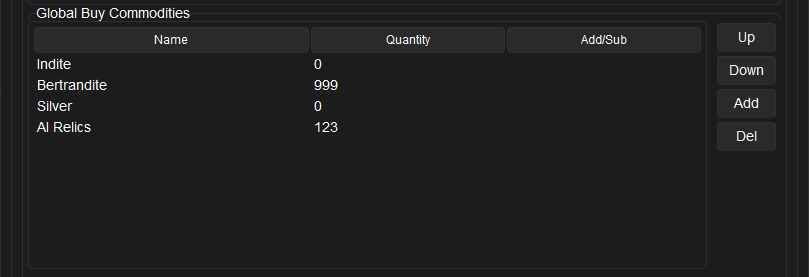

# Waypoint Editor
Waypoints editor allows you to edit Waypoints.

## Waypoint Editor



### Main buttons

* New
* Open
* Save
* Save As
* Import Spansh CSV
* Import from Inara - see below

### Import from Inara
Select with the mouse the data from one 'row' as shown below.


When pasted into the window, the data should look like this, with the data To, From, Buy, Buy Price, Sell, Sell Price on separate rows:

```py
From Fraknoi Hub | Tschapa︎
To Aisling's Asteroid | Col 285 Sector TD-Q b19-2︎
Station distance	936 Ls
Buy	Bertrandite
Buy price	1,683 Cr
Supply	5,757
Sell	Haematite
Sell price	9,140 Cr | +5,567 Cr (155%)
Demand	187,972︎
Station distance	4 Ls
```

### Waypoints List



The list...

### Waypoints Options


* Gal
  * Typ
  * Num
* Sys
  * typ
  * Num
* Upda
* Flle

### Buy/Sell Commodities



* Name
* Qua
* Add/Sub
* Up/Down
* Add/Del

## Global Shopping List
A set of waypoints can be endlessly repeated by using a special row at the end of the waypoint file with the system name as **'REPEAT'**. When hitting this record and as long as **Skip** is not ture, the Waypoint Assist will start from the top jumping through the defined Systems until the user ends the Waypoint Assist.



### Options



* Update Commodity Count

### Global Buy Commodities



* Name
* Qua
* Add/Sub
* Up/Down
* Add/Del
